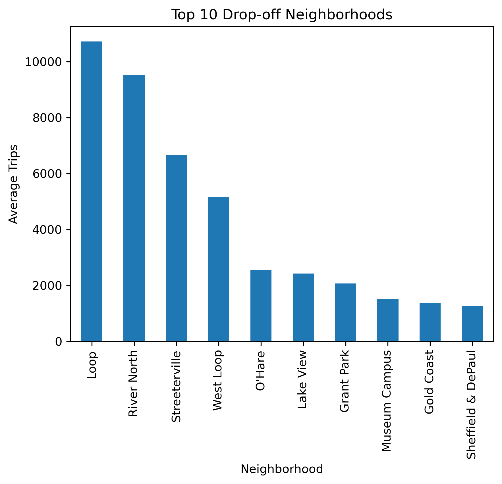
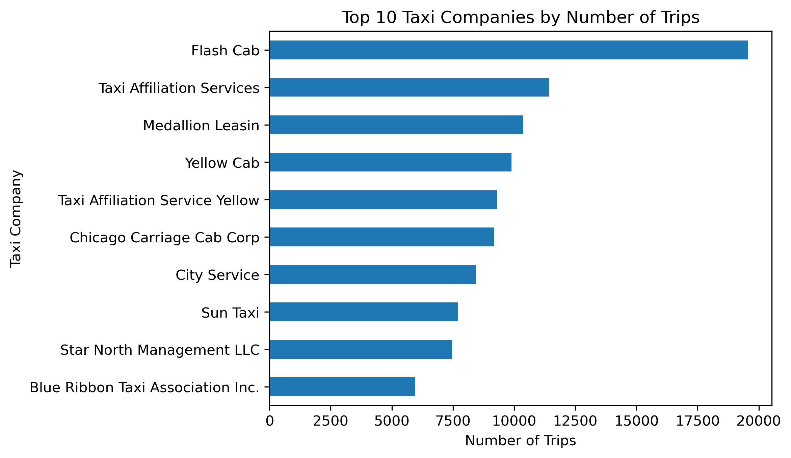

# Zuber Taxi Trip Analysis

Análisis de datos de viajes en taxi en Chicago para identificar patrones de demanda, principales destinos y compañías, y evaluar la relación entre las condiciones climáticas y la duración de los viajes.

## Objetivo

Analizar datos de viajes en taxi en Chicago con el objetivo de:

- Identificar las zonas con mayor promedio de viajes finalizados.
- Analizar las compañías de taxi con mayor número de viajes.
- Comparar la duración de los viajes bajo diferentes condiciones climáticas.
- Evaluar mediante una prueba de hipótesis si existen diferencias estadísticamente significativas en la duración de los viajes entre el Loop y el Aeropuerto Internacional O'Hare durante los sábados.

## Tecnologías y herramientas

- Python
- Pandas
- NumPy
- Matplotlib
- Seaborn
- SciPy
- Jupyter Notebook
- GitHub

## Habilidades demostradas

- Limpieza y preparación de datos
- Análisis exploratorio de datos (EDA)
- Manipulación de datos con Pandas
- Visualización de datos
- Análisis estadístico
- Formulación de hipótesis
- Prueba de Levene
- Prueba t para muestras independientes
- Interpretación de resultados

## Análisis realizado

El proyecto se divide en tres áreas principales:

### Principales destinos

Se analizaron los barrios de Chicago según el promedio de viajes finalizados para identificar las zonas con mayor actividad.

### Compañías de taxi

Se comparó el número de viajes realizado por las diferentes compañías para identificar a los principales operadores dentro de los datos analizados.

### Condiciones climáticas y duración de los viajes

Se analizaron los viajes realizados los sábados entre el Loop y el Aeropuerto Internacional O'Hare, comparando su duración bajo condiciones climáticas favorables y desfavorables.

Posteriormente, se realizó una prueba estadística para determinar si la diferencia observada entre ambos grupos era estadísticamente significativa.

## Principales resultados

- **Loop** presentó el mayor promedio de viajes finalizados y fue el único barrio que superó los 10,000 viajes promedio.



- **Flash Cab** registró el mayor número de viajes, con cerca de 20,000 durante el período analizado.


  
- Los viajes entre el Loop y el Aeropuerto Internacional O'Hare tuvieron una duración promedio aproximadamente **7 minutos mayor bajo condiciones climáticas desfavorables**.
- La prueba de hipótesis obtuvo un **p-value ≈ 6.52 × 10⁻¹²**, proporcionando evidencia estadísticamente significativa de una diferencia en la duración promedio de los viajes entre ambas condiciones climáticas.

## Dataset

El análisis utiliza tres datasets con información sobre:

- Compañías de taxi y número de viajes.
- Barrios de Chicago y promedio de viajes finalizados.
- Viajes entre el Loop y el Aeropuerto Internacional O'Hare, incluyendo fecha, condiciones climáticas y duración del trayecto.

## Estructura del proyecto

```text
zuber-taxi-trip-analysis/
│
├── images/
│   ├── top_10_neighborhoods.png
│   └── top_10_taxi_companies.png
├── zuber_taxi_trip_analysis.ipynb
├── project_sql_result_01.csv
├── project_sql_result_04.csv
├── project_sql_result_07.csv
└── README.md
``` 

## Conclusión

El análisis permitió identificar patrones relevantes en la actividad de taxis de Chicago, tanto en la concentración de viajes por destino y compañía como en la duración de los trayectos bajo distintas condiciones climáticas.

Los resultados muestran una diferencia estadísticamente significativa en la duración promedio de los viajes entre el Loop y el Aeropuerto Internacional O'Hare según las condiciones climáticas, proporcionando evidencia de una asociación entre ambas variables sin implicar necesariamente una relación causal.
